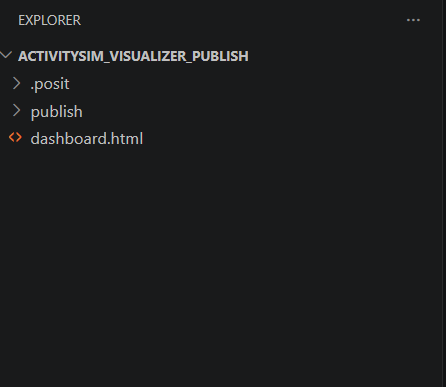
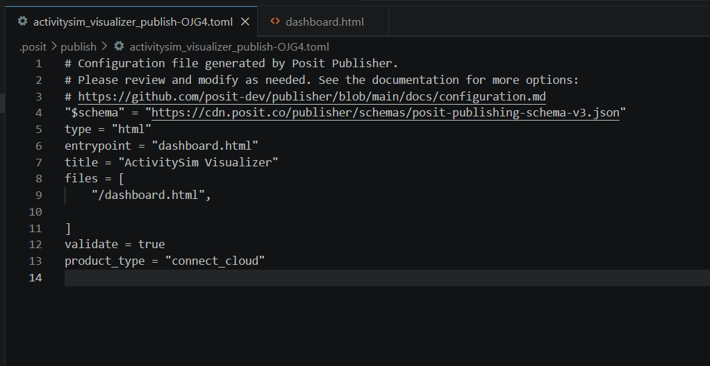

# 17 - Publish An Export With Posit Connect Cloud

This guide publishes an ActivitySim Visualizer HTML export to Posit Connect
Cloud. Posit Connect Cloud has a free plan for public content and supports
publishing from Positron or Visual Studio Code (VS Code).

This procedure hosts the standalone HTML export. It does not run the live
Python/Panel dashboard, and it does not use `pipeline.dashboard_mode: host` or
the reserved `dashboard.host` configuration. The published dashboard has the
same pages, selectors, and limitations as the local HTML export.

> **Privacy:** Content on the free plan is public. Do not publish model results
> that contain confidential, licensed, or otherwise restricted information.
> Check the current [Connect Cloud plans](https://connect.posit.cloud/plans)
> before you publish because plan features and limits can change.

## Before You Start

You need:

- a completed standalone HTML export;
- a free Posit Connect Cloud account;
- Positron, or VS Code with the Posit Publisher extension; and
- permission to publish the dashboard publicly.

Positron includes Posit Publisher. In VS Code, install
[Posit Publisher from the Visual Studio Marketplace](https://marketplace.visualstudio.com/items?itemName=posit.publisher).

If you have not created an export, follow
[34 - HTML Export](34-html-export.md). Open the HTML file locally and check its
pages and selectors before you publish it. The adjacent
`<name>.diagnostics.json` file is useful for debugging, but the HTML file does
not depend on it and you do not need to publish it.

## 1. Create A Publishing Workspace

Create a small folder for the deployment and copy the finished HTML file into
it. For example:

```text
activitysim_visualizer_publish/
├── dashboard.html
└── .posit/
    └── publish/
        └── <deployment>.toml
```

The `.posit/` directory does not exist at first. Posit Publisher creates it
when you configure the deployment.



*A small publishing workspace keeps the exported dashboard separate from the
development repository.*

A separate workspace is optional, but it makes the deployment contents clear.
It also reduces the chance that you publish source data, caches, configuration
files, or other project files by mistake. If the publishing folder is inside
the repository, open that folder (not the repository root) as the IDE workspace.

## 2. Add A Connect Cloud Credential

1. Open **Posit Publisher** from the Activity Bar.
2. Expand **CREDENTIALS**, then select **+**.
3. Select **Posit Connect Cloud**.
4. Sign in or create an account in the browser window.
5. Confirm that the authorization code in the browser matches the code in the
   IDE.
6. Select **Continue**, then **Authorize**.
7. Return to the IDE and confirm or enter a credential nickname.

The credential now appears in Posit Publisher. If you start a deployment
without a credential, Publisher can also guide you through this process.

## 3. Create The Deployment

1. Open the publishing workspace in Positron or VS Code.
2. Open **Posit Publisher**.
3. Select **+** to create a deployment.
4. Select `dashboard.html` as the entrypoint.
5. Select **New deployment**.
6. Enter a title, such as `ActivitySim Visualizer`.
7. Select the Connect Cloud credential.
8. Review the generated TOML configuration.
9. Under **PROJECT FILES**, include only `dashboard.html`.
10. Select **Deploy Your Project**.

The ActivitySim Visualizer HTML export is self-contained. A static deployment
does not need the source repository, visualizer configuration, summary caches,
Python environment, `requirements.txt`, or diagnostics sidecar.

Publisher displays a success notification and a **View Content** button after
a successful deployment. If deployment fails, select **View Publishing Log**
and inspect the revision history linked from the log.

## 4. Review The Publisher Configuration

Publisher stores its deployment configuration in a TOML file under `.posit/`.
A focused configuration for this deployment looks like this:



*The generated configuration identifies the HTML entrypoint and limits the
deployment to that file.*

```toml
"$schema" = "https://cdn.posit.co/publisher/schemas/posit-publishing-schema-v3.json"
type = "html"
entrypoint = "dashboard.html"
title = "ActivitySim Visualizer"
product_type = "connect_cloud"

files = [
  "/dashboard.html",
]
```

| Setting | Meaning |
|---|---|
| `type` | The content type. Use `html` for the standalone export. |
| `entrypoint` | The file that Connect Cloud opens. |
| `title` | The title shown in Connect Cloud. |
| `product_type` | The publishing target. Use `connect_cloud`. |
| `files` | Project-relative files included in the deployment. |

The `files` setting uses `.gitignore`-style include patterns. A leading `/`
selects a file at the publishing-workspace root. Listing only
`/dashboard.html` prevents Publisher from including unrelated files.

Publisher owns the configuration format and can add fields as the extension
changes. Start with the generated file, then narrow its `files` list. See the
[Posit Publisher configuration reference](https://github.com/posit-dev/publisher/blob/main/docs/configuration.md)
for the current schema.

## 5. Check And Share The Published Dashboard

Open **View Content** and check the same items that you checked locally:

- every intended dashboard page appears;
- page and global selectors change the displayed content;
- charts, tables, and labels render correctly; and
- no data that must remain private is present.

Connect Cloud gives the content a public URL similar to:

```text
https://[content-id].share.connect.posit.cloud
```

Use **Share** or **Standalone View** on the content page to copy the viewer
link. Standalone View removes the Connect Cloud management interface and is
usually the clearest link to give dashboard users.

## 6. Update The Dashboard

After you create a new ActivitySim Visualizer export:

1. replace `dashboard.html` in the publishing workspace;
2. open Posit Publisher;
3. select the existing deployment;
4. confirm that only the intended project files are included; and
5. select **Deploy Your Project**.

Keep the `.posit/` directory. Its TOML files identify the existing deployment.
If you lose them, Publisher cannot update that content item from the same local
configuration. You can create a new deployment, but it will be a different
content item.

## 7. Set A Readable URL

The default content ID is difficult to remember. To set a readable address:

1. open the published content's administration page;
2. select **Edit settings**;
3. open the **URL** settings;
4. enter a unique custom name; and
5. save the change.

The resulting URL follows this pattern:

```text
https://[account-name]-[custom-name].share.connect.posit.cloud
```

This customizable Connect Cloud URL is available separately from paid custom
domain features. See the official
[content settings documentation](https://docs.posit.co/connect-cloud/user/manage/content_settings.html)
for current options.

## Common Problems

| Problem | Check |
|---|---|
| Publisher does not offer Connect Cloud | Update Posit Publisher and confirm that you selected a Connect Cloud credential. |
| Publisher selects the wrong files | Open the publishing folder as the workspace and restrict `files` to `/dashboard.html`. |
| The deployment creates a new content item | Select the existing deployment and keep its `.posit/` configuration. |
| The deployed page differs from the live dashboard | Confirm the behavior in the local HTML export. Prepared-data sections and live-only callbacks are not part of export mode. |
| A selector value is absent | Add the value to the export configuration, rebuild the HTML, and publish it again. |
| The HTML file is unexpectedly large | Review the export diagnostics sidecar and reduce exported pages, selector values, or regions. |
| Deployment fails without a clear message | Open **View Publishing Log**, then inspect the linked Connect Cloud revision. |

For export-specific diagnosis, see
[34 - HTML Export](34-html-export.md#debugging-exports) and
[90 - Troubleshooting](90-troubleshooting.md#export-problems).

## Official References

- [Publish from Positron or VS Code](https://docs.posit.co/connect-cloud/user/publish/ide.html)
- [Connect Cloud plans](https://connect.posit.cloud/plans)
- [Posit Publisher configuration](https://github.com/posit-dev/publisher/blob/main/docs/configuration.md)
- [Connect Cloud content settings](https://docs.posit.co/connect-cloud/user/manage/content_settings.html)

## Related Chapters

- [12 - Running Workflows](12-running-workflows.md)
- [16 - Dashboard User Guide](16-dashboard-user-guide.md)
- [30 - Output Visualizer](30-output-visualizer.md)
- [34 - HTML Export](34-html-export.md)
- [43 - Weighting And Hosting Extensions](43-weighting-hosting-extensions.md)
